# 🕹️ Platform Flight Simulator | Digital Twin & Guided Sandbox

[](https://github.com/FreeFades2Black/platform-flight-simulator/actions)
[](https://freefades2black.github.io/platform-flight-simulator/)
[](https://github.com/FreeFades2Black/platform-flight-simulator)
[](https://github.com/FreeFades2Black/platform-flight-simulator#triage--failure-modes-taxonomy)

> An interactive, scenario-driven **Platform Flight Simulator** and guided digital twin sandbox. Instead of passive markdown runbooks, engineers learn by stepping through live state machines, watching real-time packet and buffer flows, intentionally injecting chaos, and executing real Linux/Kubernetes triage commands to remediate complex production incidents.

---

## ⚡ Interactive Triage Preview



*Live demonstration above: Path MTU Black Hole anomaly on Pipeline 2 → 3. The engineer uses `tcpdump` to trace `ICMP 3, 4: Need to Frag` drops across the VXLAN overlay, executes `fix-mtu` to clamp overlay MTU to 1420B, and watches the topology transition to nominal flowing SVG packet particles.*

---

## 💡 The Senior Platform Architectural Tenets

> ### 🌐 1. The Ingest & Edge Layer
> *"At line rate, standard tooling hides failures. Synthetic health checks pass because small packets fit within a 1500-byte frame, but high-throughput telemetry batches get dropped at the overlay boundary because VXLAN adds 50 bytes of encapsulation with the DF bit set."*
>
> ### ⚙️ 2. The Compute & JVM Boundary
> *"When high connection counts surge into Kafka, checking server.log yields nothing. OpenJDK defaults -XX:MaxDirectMemorySize to -Xmx, meaning the JVM believes it can consume 12GB inside an 8GB container. The Linux kernel cgroup controller reaps the process with SIGKILL 137 from the outside."*
>
> ### 🛡️ 3. The Block Storage & Recovery Plane
> *"When stateful nodes fail ungracefully, you can't rely on manual kubectl delete commands at 2:00 AM. We automate node fencing via Node Health Check and Self-Node Remediation using the native out-of-service taint to release exclusive SCSI-3 locks automatically, while deploying storage-aware readiness probes so filesystems that flip to read-only fail fast before corrupting partition state."*

---

## 🏛️ System Topology (5 Nodes · 4 Pipelines)

```
[ NODE 1: EDGE TELEMETRY ]
           │
      ( Pipeline 1: mTLS Handshake & NLB SYN Flood )
           ▼
[ NODE 2: GATEWAY INGRESS ]
           │
      ( Pipeline 2: Path MTU 1550B & NetworkPolicy Deny )
           ▼
[ NODE 3: CNI OVERLAY WIRE (flannel.1 / VXLAN) ]
           │
      ( Pipeline 3: DirectByteBuffer & SASL SCRAM Auth )
           ▼
[ NODE 4: KAFKA-BROKER-0 (Node B Storage AZ1) ]
           │
      ( Pipeline 4: Multi-Attach Lock & CSI gRPC Timeout )
           ▼
[ NODE 5: CSI VOLUME (/dev/nvme0n1 / rbd0) ]
```

---

## 📋 Triage & Failure Modes Taxonomy (18 Scenarios)

This taxonomy organizes the 18 primary failure modes across modern cloud-native data ingestion pipelines.

> 📖 **Comprehensive Documentation References:**
> * **Exhaustive 18-Scenario Runbook:** [docs/COMPLETE_FAILURE_TAXONOMY_RUNBOOK.md](docs/COMPLETE_FAILURE_TAXONOMY_RUNBOOK.md) *(Full failure physics, log snippets, step-by-step CLI commands, and verification for all 18 scenarios)*
> * **Terminal CLI Cheat Sheet:** [docs/interview_operational_cheat_sheet.md](docs/interview_operational_cheat_sheet.md) *(Formatted for terminal review via nano/less across all 9 topology stages)*
> * **Technical Interview Whiteboard Strategy:** [docs/INTERVIEW_DEMO_STRATEGY.md](docs/INTERVIEW_DEMO_STRATEGY.md) *(Scripted talking points and live demonstration walkthrough)* Each scenario includes authentic kernel, container runtime, and Kubernetes log signatures alongside deterministic triage and remediation playbooks:

| Topology Component | Failure Mode | Authentic Error Signature / Kernel Log | Triage & Remediation Command |
| :--- | :--- | :--- | :--- |
| **Node 1: Edge Telemetry** | **Local Buffer Ring Exhaustion** | `BufferOverflowException: queue full (10000/10000 events)` | `iot-agent flush-buffer` |
| **Node 1: Edge Telemetry** | **Serialization Schema Violation** | `SchemaNotFoundException: failed to fetch schema ID 412` | `iot-agent reload-schema` |
| **Pipeline 1: Edge → Ingress** | **mTLS Handshake / Cert Expiration** | `SSLHandshakeException: PKIX path building failed: unable to find valid certification path` | `renew-cert` |
| **Pipeline 1: Edge → Ingress** | **L4 NLB SYN Flood Throttling** | `TCP: request_sock_TCP: Possible SYN flooding on port 9092. Sending cookies.` | `tune-syn-backlog` |
| **Node 2: Gateway Ingress** | **CoreDNS Internal Service Resolution** | `dial tcp: lookup kafka-broker-0 on 10.96.0.10:53: no such host (NXDOMAIN)` | `restart-coredns` |
| **Node 2: Gateway Ingress** | **Target Group Backend Health Check** | `503 Service Temporarily Unavailable: no healthy upstream (probe timeout)` | `restart-broker` |
| **Pipeline 2: Ingress → CNI** | **Path MTU Black Hole (Overlay Encap)** | `ICMP 3, 4: Destination Unreachable (Fragmentation Needed and DF set)` | `fix-mtu` |
| **Pipeline 2: Ingress → CNI** | **Zero-Trust NetworkPolicy Ingress Block** | `packet dropped by policy 'deny-all-ingress': TCP 9092 not permitted` | `allow-netpol` |
| **Node 3: CNI Overlay Wire** | **Netfilter Conntrack Table Saturation** | `dmesg: nf_conntrack: table full, dropping packet (262,144/262,144)` | `flush-conntrack` |
| **Node 3: CNI Overlay Wire** | **Socket Buffer Ring Overflow** | `flannel.1: RX dropped: 128492 (NETDEV WATCHDOG: transmit queue timed out)` | `tune-ring-buffer` |
| **Pipeline 3: CNI → Broker** | **DirectByteBuffer Native Allocation Stall** | `java.lang.OutOfMemoryError: Direct buffer memory (SocketChannel.read failed)` | `tune-direct-memory` |
| **Pipeline 3: CNI → Broker** | **Broker SSL/SASL SCRAM Authentication**| `SaslAuthenticationException: Failed to configure SASL client: Client unable to authenticate` | `rotate-sasl` |
| **Node 4: Kafka Broker** | **cgroup v2 Hard Ceiling Breach (OOM)** | `dmesg: Memory cgroup out of memory: Kill process 28412 (java) score 982 -> Exit Code 137` | `resolve-oom` |
| **Node 4: Kafka Broker** | **Under-Replicated Partitions (ISR Drop)**| `UnderReplicatedPartitions > 0: In-sync replicas (1) is less than configured minimum (2)` | `reassign-partitions` |
| **Pipeline 4: Broker → Storage**| **Exclusive Lock Contention (Multi-Attach)**| `FailedAttachVolume: VolumeAttachment is already attached to node-b-storage-az1` | `unlock-storage` |
| **Pipeline 4: Broker → Storage**| **CSI Driver gRPC Controller Timeout** | `rpc error: code = DeadlineExceeded desc = context deadline exceeded while awaiting headers` | `restart-csi` |
| **Node 5: CSI Volume** | **Kernel Disk I/O Stall (Read-Only Mount)**| `EXT4-fs error (device rbd0): deleted inode referenced -> Remounting filesystem read-only` | `fsck-remount-rw` |
| **Node 5: CSI Volume** | **Volume Quota Depletion (Zero Inodes/ENOSPC)**| `KafkaStorageException: No space left on device (0 free inodes / 100% capacity)` | `clean-log-dirs` |

---

## 🎯 Technical Interview Demonstration Strategy

> Complete interview presentation guide and scripted talking points are available in [docs/INTERVIEW_DEMO_STRATEGY.md](docs/INTERVIEW_DEMO_STRATEGY.md).

When interviewing for Senior Platform Delivery & Reliability roles, this simulator serves as an interactive architecture whiteboard to demonstrate cross-layer diagnostics:

### 1. The Wire Trap (Pipeline 2 → 3: Ingress to CNI Overlay)
* **The Physics:** Physical MTU is 1500B. Line-rate telemetry generates 1460B payload + 40B TCP/IP = 1500B. Flannel VXLAN adds a 50-byte encapsulation header, pushing total wire frame size to **1550 Bytes** with Don't Fragment (`DF=1`).
* **The Insight:** Synthetic unit tests pass because small payloads never exceed MTU. In production, un-clamped CNI interfaces silently drop full packets. If intermediate middleboxes block ICMP Type 3, connections hang without RST or FIN.
* **Triage:** `tcpdump -nnvv -i eth0`, inspect `flannel.1 FRAME_TOO_LONG`, execute `fix-mtu` to clamp overlay MTU to 1420B.

### 2. The Invisible Reaper (Node 4: cgroup v2 vs Application Logs)
* **The Physics:** Container memory ceiling is 8192MB. JVM Heap is allocated 4096MB. High connection volume causes Netty off-heap direct buffers (`DirectByteBuffer`) to expand to 4350MB. Combined RSS reaches 8446MB.
* **The Insight:** Kafka's `server.log` has zero entries because the Linux kernel cgroup subsystem executes an uncatchable `SIGKILL (Exit Code 137)` directly against the process. Searching application logs is a diagnostic anti-pattern.
* **Triage:** `dmesg -T | grep -i oom`, inspect `cgroup.memory.current`, clamp `-XX:MaxDirectMemorySize=2048m` (`resolve-oom`).

### 3. The Frozen Disk (Pipeline 4: CSI VolumeAttachment Deadlock)
* **The Physics:** Node B crashes or network flaps abruptly while holding an exclusive `ReadWriteOnce` AWS EBS or Ceph block volume attachment.
* **The Insight:** Replacement broker scheduled to Node C hangs in `ContainerCreating` with `FailedAttachVolume: Multi-Attach error`. The cloud controller refuses concurrent attachments to prevent silent data corruption.
* **Triage:** Inspect `kubectl get volumeattachment`, prune the stale API attachment object (`unlock-storage`), allowing the CSI driver to attach the volume to Node C.

---

---

## 🚨 Field Triage Case Studies: The SRE Production Trilogy

These three documented production incidents demonstrate root-cause isolation across the physical wire, Linux kernel cgroups, and storage controllers:

### Incident 01 (INC-409): Ungraceful Node Shutdown & CSI Multi-Attach Deadlock
* **Site:** `site-22-socom-airgap` | **Alert:** `KafkaIngestLagSpike`
* **Symptoms:** Node `site22-worker-03` crashed with a kernel panic. The scheduler spun up `kafka-broker-2` on `site22-worker-05`, but the pod remained frozen in `ContainerCreating` for 12+ minutes. Field ops executed `kubectl delete pod` to reset it, causing the pod to freeze in `Terminating`.
* **The Kernel/CSI Mechanics:** The dead node's kubelet died instantly without executing the container stop, filesystem unmount, or volume detach lifecycle hooks. The cloud storage controller (AWS EBS, Ceph RBD) maintained an exclusive `ReadWriteOnce` SCSI-3 reservation lock. The `attachdetach-controller` refused attachment to prevent dual-writer filesystem corruption. Deleting the pod only appended a `deletionTimestamp` without releasing the lock.
* **Triage & Remediation:**
  ```bash
  # 1. Verify multi-attach error event
  kubectl describe pod kafka-broker-2 -n lakehouse-platform
  # 2. Identify the stale lock
  kubectl get volumeattachments | grep site22-worker-03
  # 3. Automated Resolution (NHC + SNR Operator Pipeline):
  # Self-Node Remediation fences the node and applies the native taint:
  # node.kubernetes.io/out-of-service=nodeshutdown:NoExecute
  # attachdetach-controller reconciles and force-detaches the volume at T+60s automatically.
  ```

---

### Incident 02 (INC-410): The Invisible Reaper — cgroup v2 OOM vs. JVM DirectByteBuffer
* **Site:** `site-08-gov-east` | **Alert:** `KafkaBrokerCrashLooping`
* **Symptoms:** Broker 0 crashed repeatedly during the morning telemetry burst, running for 90 seconds before abruptly vanishing. `server.log` contained zero warnings, zero errors, and zero stack traces.
* **The Kernel/JVM Mechanics:** In Java/OpenJDK, `-XX:MaxDirectMemorySize` defaults to `-Xmx` (6GB) if omitted. Under high telemetry bursts, Netty allocated off-heap direct memory via `ByteBuffer.allocateDirect()` directly from OS RAM for zero-copy socket reads. Heap (6GB) + Direct Memory (1.8GB+) + Metaspace/Thread Stacks exceeded the 8GiB cgroup limit. Because the JVM heap was under 6GB, no `OutOfMemoryError` was thrown; the Linux kernel cgroup monitor tripped and sent a non-catchable **`SIGKILL (Exit Code 137)`**, terminating the process instantly in kernel space.
* **Triage & Remediation:**
  ```bash
  # 1. Confirm kernel assassination in host ring buffer
  dmesg -T | grep -E -i 'oom|kill|memory cgroup'
  # Output: Memory cgroup out of memory: Kill process 28412 (java) score 982
  # 2. Enforce explicit off-heap ceiling in container env:
  # -Xms4g -Xmx4g -XX:MaxDirectMemorySize=2048m -XX:+ExitOnOutOfMemoryError
  ```

---

### Incident 03 (INC-411): The Frozen Disk — Kernel Block Stall & EXT4 Read-Only Remount
* **Site:** `site-41-forward-enclave` | **Alert:** `KafkaProduceRequestFailures`
* **Symptoms:** Producers failed with `KafkaStorageException: Read-only file system`. The broker container reported `Running` and passed its TCP readiness probe, but touching `/var/lib/kafka/data/test` failed with `Read-only file system`.
* **The Kernel/Block Layer Mechanics:** Storage network latency exceeded the Linux SCSI block I/O timeout threshold (`blk_update_request: I/O error`). The EXT4 Journaling Block Device (JBD2) detected an aborted journal commit. To protect filesystem metadata against irreversible corruption, the Linux kernel executed its safety policy (**`errors=remount-ro`**), immediately flipping the mounted superblock to Read-Only (`ro`). The process remained in RAM and answered TCP probes, but all segment append syscalls (`pwrite64`) failed with `EROFS`.
* **Triage & Remediation:**
  ```bash
  # 1. Isolate mount flags and aborted journal
  mount | grep '/var/lib/kafka' # shows (ro,relatime,errors=remount-ro)
  dmesg -T | grep -E -i 'ext4|jbd2|remount'
  # 2. DO NOT remount directly on a dirty journal! Unmount first:
  kubectl scale statefulset kafka-broker --replicas=2 -n lakehouse-platform
  # 3. Replay journal and repair filesystem bitmaps on host:
  fsck.ext4 -fy /dev/rbd0
  # 4. Scale back up and harden readiness probe to verify disk writeability:
  kubectl scale statefulset kafka-broker --replicas=3 -n lakehouse-platform
  ```

## 💼 Job Requirement Alignment Matrix

| Job Requirement (Enlighten Senior Platform Delivery & Reliability) | What Was Built in the Simulator to Prove It |
| :--- | :--- |
| **"Debug and troubleshoot critical issues anywhere in the stack..."** | Modeled the entire spectrum: physical wire MTU clamps, Linux netfilter conntrack saturation (262,144 entries), kernel socket buffer drops (`rx_dropped`), EXT4 superblock read-only remounts, and JVM DirectByteBuffer off-heap exhaustion. |
| **"Deep, hands-on experience deploying, operating, and debugging K8s fleets..."** | Implemented realistic triage workflows using authentic `kubectl describe pod`, `dmesg -T`, `tcpdump -nnvv`, `conntrack -S`, `ethtool -S`, and `df -i` output parsing. |
| **"Maintain a living knowledge base of failure modes, fixes, and runbooks."** | Structured the 18-scenario matrix with explicit error signatures, diagnostic procedures, and deterministic one-command remediation playbooks. |
| **"Mentor engineers on debugging, deployment, and operational excellence."** | Built an interactive educational sandbox that allows engineers to safely inject faults, observe side effects, and practice triage commands. |

---

## ⚡ 1-Command Local Startup

Prerequisites: `node >= 18` and `npm >= 9`.

```bash
# Clone the repository
git clone https://github.com/FreeFades2Black/platform-flight-simulator.git
cd platform-flight-simulator

# Install dependencies
npm install

# Run automated state machine and taxonomy constraint tests
npm test

# Launch the Next.js interactive development server
npm run dev
```

Open [http://localhost:3000](http://localhost:3000) in your browser to enter the flight simulator!

---

## 🛠️ Tech Stack & Engineering Standards

* **Framework:** [Next.js 14](https://nextjs.org/) (App Router, Server & Client Components)
* **Interactive Canvas:** [@xyflow/react](https://reactflow.dev/) (Custom SVG nodes, bezier animated edges, packet flow particle physics)
* **State Machine:** [Zustand](https://github.com/pmndrs/zustand) (Reactive state machine syncing terminal command execution with canvas physics)
* **Styling:** [Tailwind CSS](https://tailwindcss.com/) with mission control dark cockpit design system
* **Icons:** [Lucide React](https://lucide.dev/)
* **CI/CD:** [GitHub Actions](https://github.com/FreeFades2Black/platform-flight-simulator/actions) with automated test verification, static page export, and automated GitHub Pages deployment.
